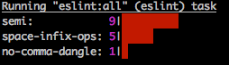

#Statistic Reporter for ESLint.
Analyses the files for error frequency, rather than location. This is helpful when introducing ESLint to an existing project.



# Install
```js
npm install --save-dev eslint-stats
```
# Getting Started
Use it with grunt:

```js
...
  eslint: {
    options: {
      format: require('eslint-stats').byError,
      src: [...]
    },
...
```

or use it directly with ESLint:
```bash
$ eslint --format node_modules/eslint-stats/byError.js
```

# Available Reporters:

### byError
Shows the eslint report, aggragated by errors, without separation into specific files.
